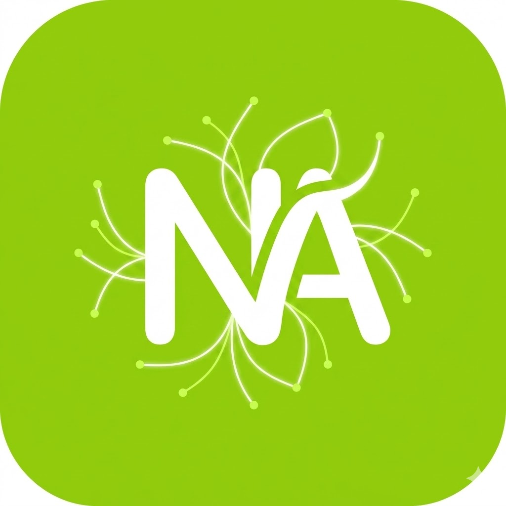

<p align="center">
  <picture>
    
  </picture>
</p>

<h1 align="center">
  Nalar<span style="color:#58CC02">.ai</span>
</h1>

<p align="center">
  <strong>🧠 Tutor AI · Belajar Aktif · Berpikir Kritis</strong><br />
  <sub>AI yang membimbing kamu <em>menemukan</em> jawaban — bukan memberikannya begitu saja</sub>
</p>

<p align="center">
  <a href="https://nalar-ai.web.id"></a>
  <a href="#-coba-sekarang"></a>
</p>

<br />

---

## 💡 Apa itu Nalar.ai?

<table>
<tr>
<td width="60%">

### Bukan chatbot biasa...

Kebanyakan AI langsung kasih kamu **jawaban instan**.  
Nalar.ai berbeda — AI ini jadi **tutor pribadi** yang:

- ❌ **Tidak** memberikan jawaban langsung
- ✅ **Bertanya balik** untuk memancing kamu berpikir
- ✅ **Memberi tantangan** (quiz, gap-fill, paraphrase)
- ✅ **Melacak progress** kamu seperti game (XP, streak, sertifikat)

<br />

```
┌─────────────────────────────────────────────┐
│  🙋 Kamu: "Jelaskan tentang fotosintesis"    │
│                                               │
│  🤖 Nalar: "Sebelum kita bahas...             │
│            Dari mana tumbuhan dapat energi?   │
│            Mereka kan nggak makan seperti     │
│            manusia 🤔"                         │
│                                               │
│  🙋 Kamu: "Dari sinar matahari?"              │
│                                               │
│  🤖 Nalar: "Benar! Tapi sinar matahari        │
│            saja nggak cukup. Bayangkan kamu   │
│            masak — butuh kompor DAN bahan     │
│            makanan. Apa 'bahan' tumbuhan?"    │
│                                               │
│  🎯 [Quiz interaktif muncul setelah ini]      │
└─────────────────────────────────────────────┘
```

</td>
<td width="40%" align="center" valign="top">

<br />
<br />

```
┌──────────────────────┐
│     🧠  Nalar.ai     │
│                      │
│   ┌──────────────┐   │
│   │  💬 Chat     │   │
│   │  Sokratik    │   │
│   └──────┬───────┘   │
│          │           │
│   ┌──────▼───────┐   │
│   │  🎯 Quiz     │   │
│   │  Interaktif  │   │
│   └──────┬───────┘   │
│          │           │
│   ┌──────▼───────┐   │
│   │  ⭐ XP +     │   │
│   │  Sertifikat  │   │
│   └──────────────┘   │
│                      │
│  💯 Gratis · No Login│
└──────────────────────┘
```

</td>
</tr>
</table>

---

## ✨ Fitur Utama

<br />

<table align="center">
  <tr>
    <td align="center" width="25%">
      <h3>🧠<br />Belajar Aktif</h3>
      <sub>Metode Sokratik<br />AI balik bertanya<br />Kamu yang menemukan<br />jawaban sendiri</sub>
    </td>
    <td align="center" width="25%">
      <h3>🎯<br />Tantangan</h3>
      <sub>Quiz · Gap Fill<br />Paraphrase · Essay<br />Menguji pemahaman<br />setelah tiap topik</sub>
    </td>
    <td align="center" width="25%">
      <h3>🔥<br />Gamifikasi</h3>
      <sub>XP Points · Streak<br />5 Nyawa · Level Up<br />Belajar terasa<br />seperti main game!</sub>
    </td>
    <td align="center" width="25%">
      <h3>🏆<br />Sertifikat</h3>
      <sub>Bukti pencapaian<br />Raih 100 XP<br />Motivasi nyata<br />untuk terus belajar</sub>
    </td>
  </tr>
</table>

<br />

---

## 🎮 Cara Kerja — 3 Langkah Simpel

<br />

```
                            ┌──────────────────┐
  ① TANYAKAN               │  💬 Ketik topik   │
     APA SAJA               │  apapun yang kamu │
                            │  ingin pelajari   │
                            └────────┬─────────┘
                                     │
                                     ▼
                            ┌──────────────────┐
  ② AI BIMBING              │  🤖 AI bertanya  │
     KAMU BERPIKIR           │  balik, memandu, │
                             │  memberi analogi │
                             └────────┬─────────┘
                                     │
                                     ▼
                            ┌──────────────────┐
  ③ SELESAIKAN              │  🎯 Quiz, Gap    │
     TANTANGAN               │  Fill, Parafrase │
                             │  ⭐ Dapatkan XP!  │
                             │  🏆 Raih Sertif  │
                             └──────────────────┘
```

<br />

---

## 🚀 Coba Sekarang

<table>
<tr>
<td>

### 📱 Tinggal buka, langsung chat!

> **Nggak perlu daftar. Nggak perlu login. Nggak ada iklan.**

1. Buka **[nalar-ai.web.id](https://nalar-ai.web.id)**
2. Klik tombol **"Mulai Sekarang"**
3. Ketik pertanyaan atau topik belajar kamu
4. AI akan membimbing — jawab, belajar, dapat XP!

</td>
<td>

```
┌─────────────────────────┐
│                         │
│     🌐 Buka Website     │
│          │              │
│          ▼              │
│  ┌─────────────────┐    │
│  │ Mulai Sekarang →│    │
│  └─────────────────┘    │
│          │              │
│          ▼              │
│    💬 "Halo! Mau belajar│
│       apa hari ini?"    │
│                         │
└─────────────────────────┘
```

</td>
</tr>
</table>

<br />

---

## 📊 Progress Kamu

```
┌──────────────────────────────────────────────────────────┐
│                                                          │
│   ❤️❤️❤️❤️❤️  Nyawa (5)    🔥🔥🔥  Streak (3 hari)     │
│                                                          │
│   Level 2 · Nalar Apprentice                             │
│   ████████████░░░░░░░░  65 / 100 XP                      │
│                                                          │
│   ┌─────────────────┐  ┌─────────────────┐              │
│   │ 🎯 Target 65%   │  │ 🏆 Total 165 XP │              │
│   └─────────────────┘  └─────────────────┘              │
│                                                          │
└──────────────────────────────────────────────────────────┘
```

> 💡 **XP +15** setiap kali kamu berhasil menyelesaikan tantangan!  
> ⚠️ Kalau salah, kehilangan 1 ❤️ nyawa & streak reset ke 0.

---

## 🏗️ Di Balik Layar

```
┌─────────────────────────────────────────────────────┐
│                    BROWSER KAMU                     │
│                                                     │
│  ┌──────────┐              ┌──────────────────┐    │
│  │ Landing  │              │    Chat Page     │    │
│  │  Page    │              │                  │    │
│  │          │              │  React 19 +      │    │
│  │  React   │              │  TypeScript      │    │
│  │  + CSS   │              │  + Tailwind      │    │
│  └──────────┘              └────────┬─────────┘    │
│                                     │              │
└─────────────────────────────────────┼──────────────┘
                                      │
                                 POST /api/chat
                                      │
┌─────────────────────────────────────┼──────────────┐
│                         VERCEL / EXPRESS           │
│                          ┌─────────┴─────────┐     │
│                          │   API Endpoint    │     │
│                          │   server.ts /     │     │
│                          │   api/chat.ts     │     │
│                          └─────────┬─────────┘     │
│                                    │               │
│                          ┌─────────▼─────────┐     │
│                          │  GLM-4 Flash AI   │     │
│                          │  (15s timeout)    │     │
│                          └───────────────────┘     │
│                                                     │
│  🛡️ Helmet · CORS · Rate Limit · Input Validation │
│  ⏱️ AbortController (504 on timeout)               │
└─────────────────────────────────────────────────────┘
```

<br />

| Layer | Teknologi |
|:------|:----------|
| 🎨 **UI** | React 19 · TypeScript · Tailwind CSS v4 · Motion |
| 🖥️ **Server** | Express.js · Node.js · Vercel Serverless |
| 🧠 **AI** | GLM-4 Flash via API Proxy |
| 📐 **Math** | KaTeX · remark-math · rehype-katex |
| 🎯 **Ikon** | Lucide React |
| 🔊 **Audio** | Web Audio API (synthetic — zero external deps) |
| ⚡ **Build** | Vite · esbuild |
| 🔒 **Security** | Helmet · CORS · Rate Limit · Input Validation · Fetch Timeout |

---

## 📁 Peta Proyek

```
NalarAI/
│
├── 🌐 Halaman Publik
│   ├── index.html          → Landing page (SEO optimized)
│   └── chat.html           → Chat page (SEO optimized)
│
├── ⚙️ Konfigurasi
│   ├── server.ts           → Express server dev
│   ├── vite.config.ts      → Vite + multi-page
│   ├── vercel.json         → Deploy config
│   ├── tsconfig.json       → TypeScript config
│   └── .env.example        → Template environment
│
├── 📦 public/
│   ├── nalarailogo.jpg     → Logo utama aplikasi
│   ├── favicon.svg         → Favicon SVG
│   ├── manifest.json       → PWA manifest
│   ├── robots.txt          → Aturan crawler
│   └── sitemap.xml         → Peta situs XML
│
├── 🧩 src/
│   ├── index.css           → Global styles + fluid type
│   ├── types.ts            → Type definitions
│   │
│   ├── 🏠 landing/         → Landing page (index.html)
│   │   ├── main.tsx
│   │   └── LandingPage.tsx
│   │
│   ├── 💬 components/      → Chat app (chat.html)
│   │   ├── ChatInterface.tsx    → Main chat UI
│   │   ├── MessageItem.tsx      → Bubble pesan
│   │   ├── WelcomeScreen.tsm    → Onboarding
│   │   ├── CertificateModal.tsx → Modal sertifikat
│   │   ├── InteractionDispatcher.tsx
│   │   └── interactions/        → Tantangan
│   │       ├── Quiz.tsx
│   │       ├── GapFill.tsx
│   │       └── Paraphrase.tsx
│   │
│   └── 🔊 utils/
│       └── audio.ts        → Web Audio API (synthetic)
│
├── 🔒 Security
│   └── SECURITY.md         → Dokumentasi keamanan lengkap
│
├── 🔌 api/
│   └── chat.ts             → Vercel serverless endpoint
│
└── 📋 plans/
    └── two-page-architecture.md
```

---

## 🛠️ Panduan Developer

### ⚡ Quick Start (5 menit)

```bash
# 1️⃣ Clone & install
git clone https://github.com/Lmavour/NalarAI.git
cd NalarAI
npm install

# 2️⃣ Setup environment
cp .env.example .env
# ✏️ Edit .env → isi AI_API_URL dan AI_API_KEY (jika ada)

# 3️⃣ Jalankan!
npm run dev
# → Landing: http://localhost:5173
# → Chat:    http://localhost:5173/chat.html
```

### 📋 Semua Perintah

| Perintah | Buat Apa? |
|:---------|:----------|
| `npm run dev` | 🔥 Jalankan dev server (hot reload) |
| `npm run build` | 📦 Build production ke `dist/` |
| `npm start` | 🚀 Jalankan production server |
| `npm run lint` | ✅ Cek TypeScript error |
| `npm run clean` | 🧹 Hapus folder `dist/` |

### 🔐 Environment Variables

```env
# 🤖 AI API
AI_API_URL="https://api.siputzx.my.id/api/ai/glm47flash"
AI_API_KEY=""                       # API key jika diperlukan

# 🌐 Server
PORT=3000                           # Port server (default: 3000)
NODE_ENV=development                # 'development' | 'production'

# 🛡️ Security
ALLOWED_ORIGINS="http://localhost:3000,https://nalar-ai.web.id"
RATE_LIMIT_WINDOW=60000             # Window rate limit (ms)
RATE_LIMIT_MAX=20                   # Max request per window
```

> ⚠️ **Jangan pernah commit `.env`!** Sudah di-`.gitignore`.

### 🚢 Deploy ke Vercel (3 langkah)

```
┌──────────────────────┐
│ 1. Push ke GitHub    │──▶  git push origin main
└──────────┬───────────┘
           ▼
┌──────────────────────┐
│ 2. Import di Vercel  │──▶  vercel.com → New Project
└──────────┬───────────┘
           ▼
┌──────────────────────┐
│ 3. Set Env + Deploy  │──▶  AI_API_URL=...  ✅ Done!
└──────────────────────┘
```

---

## 🔍 SEO & Aksesibilitas

### SEO Scorecard

```
┌──────────────────────────────────────────┐
│  ✅ Meta Tags (title, desc, keywords)    │
│  ✅ Open Graph (Facebook, WA, LinkedIn)  │
│  ✅ Twitter Card (summary_large_image)   │
│  ✅ Canonical URL                        │
│  ✅ JSON-LD (4 tipe structured data)     │
│  ✅ XML Sitemap (/sitemap.xml)           │
│  ✅ Robots.txt (/robots.txt)             │
│  ✅ PWA Manifest (/manifest.json)        │
│  ✅ Apple Touch Icon                     │
│  ✅ Color Scheme meta tag                │
│  ✅ Semantic HTML (header,main,footer)   │
│  ✅ Heading hierarchy (h1→h2→h3)         │
│  ✅ Alt texts + ARIA labels              │
└──────────────────────────────────────────┘
```

### Accessibility Checklist

```
┌────────────────────────────────────────┐
│  ♿ Skip-to-content link               │
│  🏷️  ARIA: navigation, main, banner   │
│  📊 ARIA: progressbar (valuenow/min/max)│
│  📢 ARIA: aria-live="polite" (chat)    │
│  ⌨️  Focus-visible outline style       │
│  🔤 Screen reader labels on all stats  │
│  🖼️  aria-hidden on decorative icons   │
│  🎯 Auto-focus textarea after send     │
└────────────────────────────────────────┘
```

---

## 🛡️ Security

| Layer | Implementasi |
|:------|:-------------|
| 🔒 **API Key Protection** | Server-side only — never reaches client |
| 🛡️ **Helmet.js** | CSP, X-Frame-Options, HSTS, X-Content-Type-Options |
| 🌐 **CORS** | Whitelist origin + no-credentials-by-default |
| ⏱️ **Rate Limiting** | 20 req/menit/IP pada `/api/chat` |
| ✅ **Input Validation** | Max 10 msg, max 2000 char/msg, role check |
| ⏰ **Fetch Timeout** | 15 detik timeout ke AI API (AbortController) |
| 🔊 **Self-hosted Audio** | Web Audio API — zero external CDN |

> 📖 Detail lengkap: [`SECURITY.md`](SECURITY.md)

---

## 🎨 Design Tokens

```
┌─────────────────────────────────────────┐
│  🟢 Primary   #58CC02   ████████████    │
│  🔵 Secondary #2B70C9   ████████████    │
│  🟡 Accent    #FFC800   ████████████    │
│  🔴 Error     #FF4B4B   ████████████    │
│                                         │
│  🔤 Font     Plus Jakarta Sans          │
│  ⌨️  Mono     JetBrains Mono            │
│  📐 Radius   12px – 32px (2xl – 3xl)   │
│  📏 Type     clamp(…) fluid 320→1920px │
└─────────────────────────────────────────┘
```

---

## 🤝 Ingin Berkontribusi?

```
┌──────────┐    ┌──────────┐    ┌──────────┐    ┌──────────┐
│ ① Fork   │───▶│ ② Branch │───▶│ ③ Commit │───▶│ ④ PR!    │
│   Repo   │    │   Fitur  │    │   Changes│    │          │
└──────────┘    └──────────┘    └──────────┘    └──────────┘

  git checkout -b fitur/ide-keren
  git commit -m '✨ Tambah: fitur baru'
  git push origin fitur/ide-keren
```

🔗 **[GitHub Repository](https://github.com/Lmavour/NalarAI)**

📝 **[Review Nalar.ai](https://forms.gle/wxU5Geh9TUM8hVQK7)** — beri masukan!

🤝 **[Jadi Partner](mailto:partnership@nalar-ai.web.id)** — berkolaborasi dengan kami!

> 💡 Untuk perubahan besar, silakan buka **Issue** dulu untuk diskusi ya!

---

## 📄 Lisensi

<p align="center">
  <strong>MIT License</strong> © 2026 Nalar.ai<br />
  <sub>Bebas dipakai, dimodifikasi, dan disebarluaskan</sub>
</p>

<br />

---

<p align="center">
  <picture>
    
  </picture>
  <br />
  <sub>🧠 Dibuat untuk pendidikan Indonesia · Made for Indonesian education</sub>
</p>