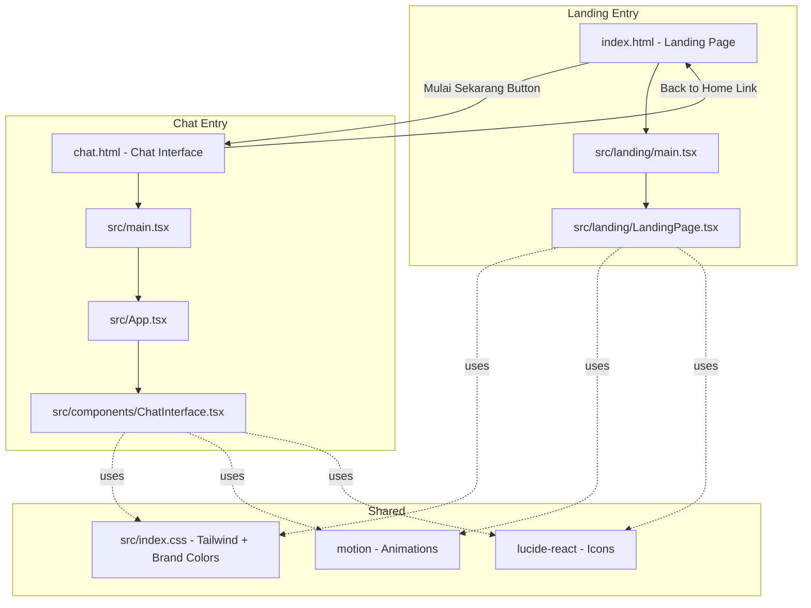
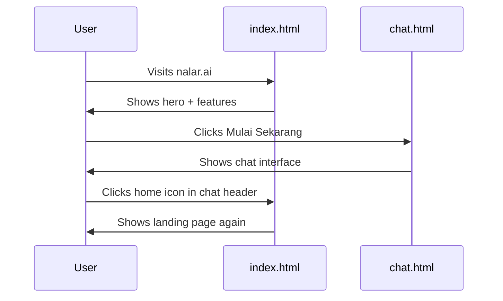

# NalarAI Two-Page Architecture Plan

## Overview

Split the current single-page React app into a **multi-page architecture** with two distinct HTML entry points:

1. **`index.html`** — SEO-optimized landing page (marketing/home page)
2. **`chat.html`** — AI chat interface (the existing app)

Navigation flow: Landing page → "Mulai Sekarang" CTA button → Chat page, and Chat page → small nav link → Landing page.

---

## Architecture Diagram



---

## Vite Multi-Page Configuration

Vite supports MPA via `rollupOptions.input`. The key change in `vite.config.ts`:

```typescript
build: {
  rollupOptions: {
    input: {
      main: path.resolve(__dirname, 'index.html'),    // Landing page
      chat: path.resolve(__dirname, 'chat.html'),      // Chat page
    },
  },
},
```

This tells Vite to produce two separate HTML bundles, each with its own React entry point and chunk splitting.

---

## File Structure After Changes

```
NalarAI/
├── index.html                  # NEW - Landing page HTML with full SEO
├── chat.html                   # UPDATED - Add nav link back to home
├── vite.config.ts              # UPDATED - MPA rollupOptions
├── server.ts                   # UPDATED - Route / to index.html, /chat to chat.html
├── src/
│   ├── index.css               # SHARED - Tailwind + brand colors
│   ├── main.tsx                # EXISTING - Chat entry point
│   ├── App.tsx                 # EXISTING - Chat root component
│   ├── types.ts                # EXISTING
│   ├── landing/                # NEW DIRECTORY
│   │   ├── main.tsx            # NEW - Landing page React entry
│   │   └── LandingPage.tsx     # NEW - Landing page component
│   ├── components/             # EXISTING - Chat components
│   │   ├── ChatInterface.tsx   # UPDATED - Add home nav link
│   │   ├── WelcomeScreen.tsx
│   │   ├── MessageItem.tsx
│   │   ├── CertificateModal.tsx
│   │   ├── InteractionDispatcher.tsx
│   │   └actions/
│   │   interactions/
│   ├── utils/
```

---

## SEO Strategy for index.html

The landing page must rank #1 for searches like "nalar ai", "nalarai", "nalar.ai". Key SEO elements:

### 1. HTML Head - Comprehensive Meta Tags

- `<title>` — keyword-rich, e.g. "Nalar.ai — Tutor AI untuk Belajar Aktif & Berpikir Kritis"
- `<meta name=description>` — compelling Indonesian description with keywords
- `<link rel=canonical>` — canonical URL
- Open Graph tags: `og:title`, `og:description`, `og:image`, `og:url`, `og:type=website`
- Twitter Card tags: `twitter:card`, `twitter:title`, `twitter:description`, `twitter:image`
- `<meta name=keywords>` — secondary keyword signal
- Hreflang tag for Indonesian content
- Favicon + apple-touch-icon

### 2. JSON-LD Structured Data

Embed a `WebApplication` schema in `<script type=application/ld+json>`:

```json
{
  "@context": "https://schema.org",
  "@type": "WebApplication",
  "name": "Nalar.ai",
  "url": "https://nalar.ai",
  "description": "Tutor AI untuk pembelajaran aktif...",
  "applicationCategory": "EducationalApplication",
  "operatingSystem": "Web",
  "offers": { "@type": "Offer", "price": "0", "priceCurrency": "IDR" }
}
```

### 3. Semantic HTML Structure

- `<header>` with `<nav>` — site navigation
- `<main>` with structured `<section>` elements using proper `<h1>`, `<h2>` hierarchy
- `<footer>` with copyright and links
- All sections use descriptive `id` attributes for anchor linking

### 4. Performance & Crawling

- Preconnect to font origins
- Preload critical fonts
- Lazy-load below-fold images
- `<meta name=robots content=index,follow>`
- Sitemap reference in robots.txt

---

## Landing Page Design - LandingPage.tsx

A modern, Duolingo-inspired landing page that feels seamless with the chat experience.

### Sections

1. **Hero Section**
   - Large animated Nalar.ai logo with Sparkles icon
   - Tagline: "Eksperimen Belajar Aktif"
   - Subtitle explaining the Socratic AI tutor concept
   - Primary CTA: "Mulai Sekarang" button → links to `/chat.html`
   - Secondary CTA: "Pelajari Lebih Lanjut" → scrolls to features
   - Background: subtle gradient or pattern matching brand green

2. **Features Section** - 3-4 feature cards
   - 🧠 Belajar Aktif — AI guides you through discovery, not just answers
   - 🎯 Tantangan Interaktif — Quiz, gap-fill, paraphrase challenges
   - 📊 Progress Tracking — XP, streaks, hearts gamification
   - 🏆 Sertifikat — Earn certificates as you learn

3. **How It Works Section** - 3 steps
   - Step 1: Ask a question
   - Step 2: AI guides you with Socratic method
   - Step 3: Complete challenges to earn XP

4. **CTA Section** - Final call to action
   - "Mulai Belajar Sekarang — Gratis!" button
   - No signup required messaging

5. **Footer**
   - Copyright, links, social

### Design Principles

- **Duolingo-style**: Bold colors, tactile shadows, rounded corners, playful but professional
- **Brand colors**: Primary `#58CC02`, Secondary `#2B70C9`, Accent `#FFC800`
- **Animations**: Use `motion` library for entrance animations matching chat page
- **Typography**: Plus Jakarta Sans, bold weights for headings
- **Mobile-first**: Responsive layout, touch-friendly buttons
- **Seamless transition**: Same visual language as chat page so users feel continuity

---

## Chat Page Updates

### chat.html Changes

- Add a small navigation link/button in the header area to go back to landing page
- Keep all existing SEO meta tags but adjust title to be chat-specific

### ChatInterface.tsx Changes

- Add a small home icon button in the top bar that links to `/` or `index.html`
- This should be subtle — a small house/home icon that does not distract from chat

---

## Server.ts Routing Updates

In production mode, the Express server currently serves `dist/index.html` for all routes via SPA fallback. This needs to change:

```typescript
// Production static serving
const distPath = path.join(process.cwd(), 'dist');
app.use(express.static(distPath));

// Specific routes
app.get('/', (req, res) => {
  res.sendFile(path.join(distPath, 'index.html'));
});
app.get('/chat', (req, res) => {
  res.sendFile(path.join(distPath, 'chat.html'));
});
// SPA fallback for other routes → landing page
app.get('*', (req, res) => {
  res.sendFile(path.join(distPath, 'index.html'));
});
```

In development, Vite middleware handles this automatically based on the HTML files in the root.

---

## Implementation Steps

1. **Configure vite.config.ts** — Add `rollupOptions.input` for MPA with both HTML entry points
2. **Create index.html** — Full SEO meta tags, JSON-LD, Open Graph, canonical URL, font preloading
3. **Create src/landing/main.tsx** — Separate React entry point that mounts LandingPage
4. **Create src/landing/LandingPage.tsx** — Full landing page component with hero, features, how-it-works, CTA, footer
5. **Update chat.html** — Keep existing structure, ensure it still works as chat entry
6. **Update ChatInterface.tsx** — Add home navigation icon/button in the header
7. **Update server.ts** — Add specific route handlers for `/` and `/chat` in production
8. **Update src/index.css** — Add any landing-page-specific utility classes if needed
9. **Test both pages** — Verify navigation between pages, SEO tags, responsive design

---

## Navigation Flow Detail



The "Mulai Sekarang" button on the landing page uses a standard `<a href=/chat.html>` link — no React Router needed since these are separate pages. Similarly, the home icon in chat uses `<a href=/>`.

---

## Risk Considerations

- **Bundle size**: Each page gets its own bundle, but shared dependencies like React, motion, lucide-react will be in shared chunks via Vite's automatic chunk splitting. No significant size increase.
- **HMR in dev**: Vite MPA supports HMR for each page independently. Both pages will hot-reload correctly.
- **Build output**: Vite will output both `index.html` and `chat.html` in the `dist/` folder with proper asset references.
- **SEO rendering**: Since this is client-side React, the landing page HTML will have meta tags in the `<head>` but content renders via JS. For maximum SEO, the structured data and meta tags in the HTML `<head>` are the primary SEO vehicle — Google can index client-rendered content but the `<head>` tags are immediately crawlable.